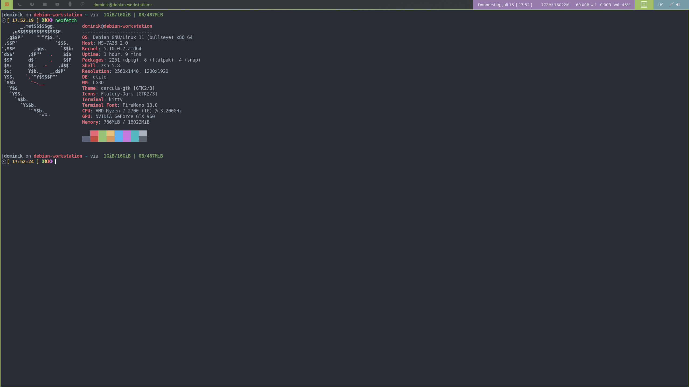
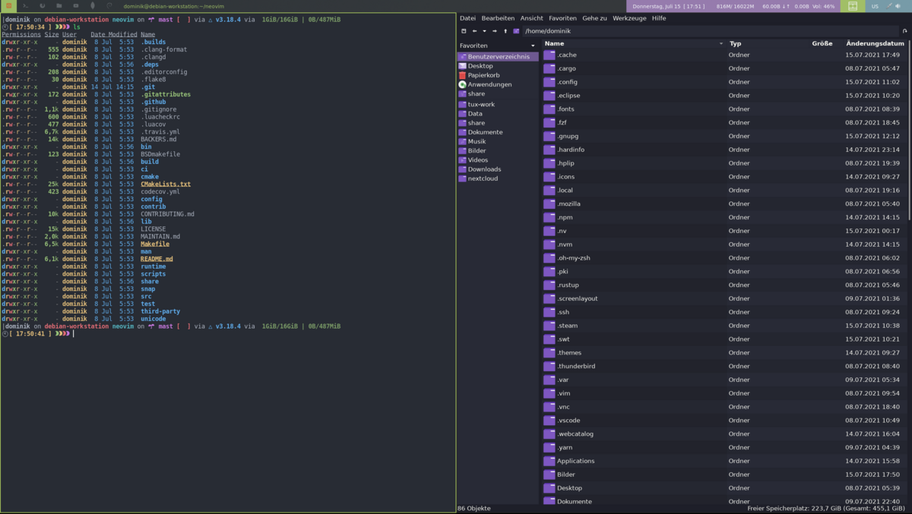
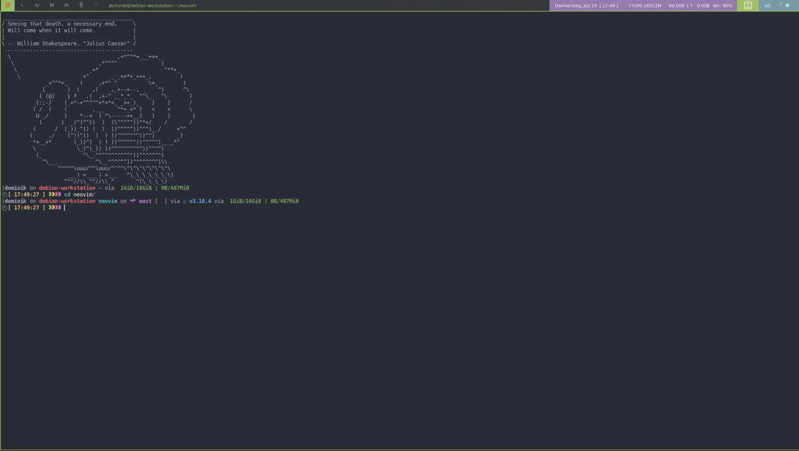
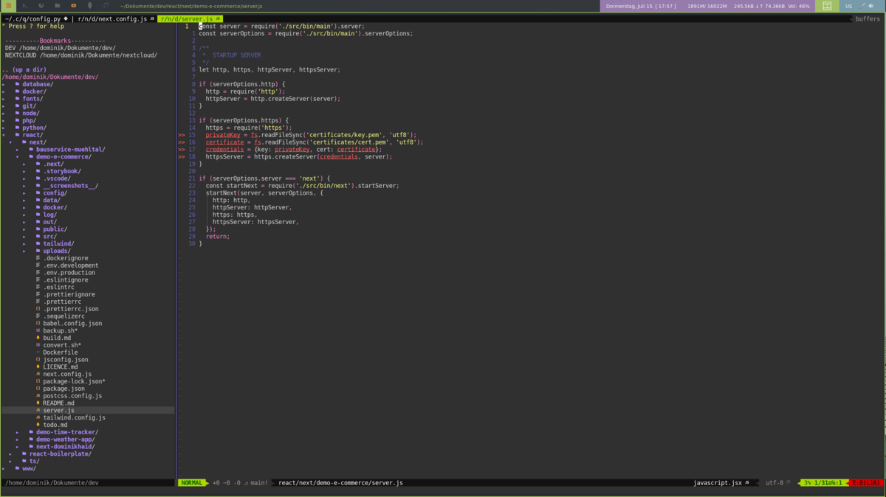
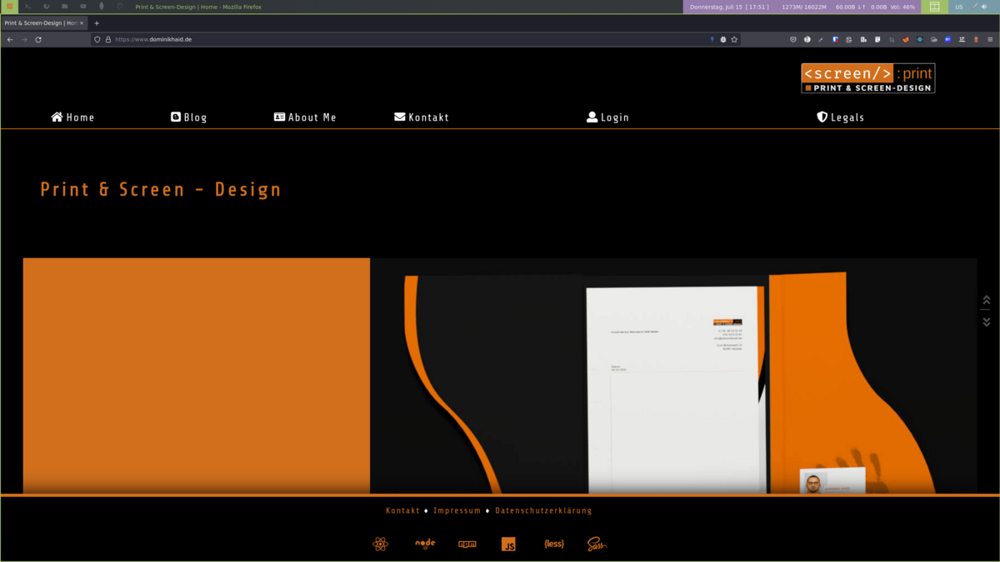

# Debian Installer - DEV Edition

## Description

Automated setup for Debian 11 systems.

## Use

> sudo ./install.sh

- input root password
- input name of the user u want install the tools for
- input the password of the user

To add ne funtions create a new script in inside /script/functions/main.
The scripts inside this directory will be automatically soruced and excuted.
All functions are located in /script/functions/backups and link from there to one of the pre, main or post folders.
Removing the files from the pre, main or post folder will prevent them from run.
To enable a removed functions just relink it from the backup dir to ether the pre, main or post folder, depending on in wich stage of the install process the function should run.

**NOTE The installer is using some Nerd Font Glyphs, they want be displayed without at least one Nerd Font installed**
**NOTE completing the setup might take a wile**

## Includes

- Lxde
- Qtile WM
- Nvm / Node.js Lts
- Eslint, Typescript, Prettier, Yarn
- Php 8
- Lua
- Java
- Go
- Rust (broot, procs, sd)
- Python & Pip 3
- Nvim & Plugins, with Lsp, Debugger and many more
- Flatpak & Snap
- Vnc Server
- LightDM
- Docker and Docker Compose
- Apache2 & Nginx

## Preview

## TODO

- Warn if on know Debian version
- Give Possibility to change the branch Advance the detected dialog slepp after pull clear screen
- Picom
- Fix Qemu test

### Next release

- Nvidia optional install
- Server Branch
- Wayland
- Continue Raspberry Pi branch
- Dynamic Branch
